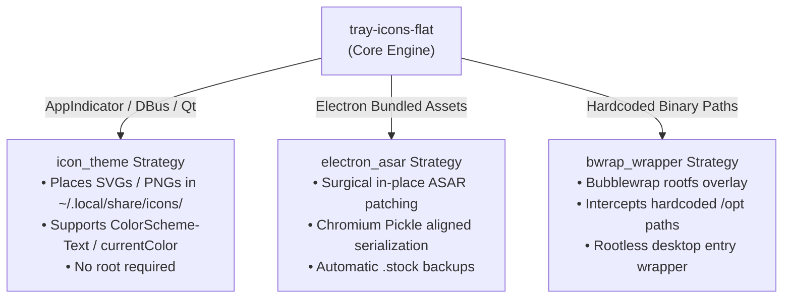

# tray-icons-flat

<p align="center">
  <strong>Universal Linux system tray icon fixer, converter, and persistence daemon.</strong>
</p>

<p align="center">
  <a href="#features">Features</a> •
  <a href="#quick-start">Quick Start</a> •
  <a href="#how-it-works">How It Works</a> •
  <a href="#recipes">Recipes</a> •
  <a href="#image-converter">Image Converter</a> •
  <a href="#persistence-service">Persistence Service</a> •
  <a href="#contributing">Contributing</a>
</p>

---

Have you ever switched your Linux desktop to a clean dark or light theme, only to have third-party apps ruin your system tray with ugly, solid-color rectangular backgrounds, saturated neon logos, or unreadable low-contrast icons?

**`tray-icons-flat`** automatically detects, adapts, and fixes inconsistent system tray icons across all major Linux desktop environments (**KDE Plasma**, **GNOME** *(via AppIndicator)*, **XFCE**, **Cinnamon**, **Sway/Waybar**, etc.). It replaces them with elegant, transparent, monochrome/symbolic icons without requiring root access or breaking your system.

---

## <a id="features"></a>✨ Features

- 🔍 **Auto-Scan (`scan`)**: Instantly detects installed apps known to have broken or out-of-place tray icons and tells you whether they are currently in stock or fixed state.
- ⚡ **One-Click Fix (`fix --all`)**: Applies aesthetic fixes across all detected applications in seconds.
- ↩️ **Safe & Reversible (`revert`)**: Never destroys your original files. Creates pristine `.stock` backups before touching anything, allowing instant rollbacks.
- 🛠️ **Non-Invasive Strategies**:
  - **XDG Icon Theme Overrides (`icon_theme`)**: Standard vector SVGs supporting dynamic system colors (`currentColor` / `ColorScheme-Text`) placed in `~/.local/share/icons/`.
  - **Safe Electron ASAR Patcher (`electron_asar`)**: In-memory inspection and surgical asset replacement for bundled Electron packages without corrupting package headers.
  - **Bubblewrap Sandbox Interceptors (`bwrap_wrapper`)**: Overlays hardcoded absolute paths for closed-source binaries without `sudo`.
- 🔄 **Update-Proof Persistence (`service`)**: Optional lightweight `systemd --user` service that ensures icons stay fixed even after package updates.
- 🎨 **Built-In Icon Converter (`convert`)**: Removes solid white/black backgrounds, calculates alpha edges, centers graphics, and generates tray-ready 22x22 / 24x24 px monochrome icons from any arbitrary image or logo.
- 🧩 **Modular Recipe Engine**: Add support for any app with a simple YAML manifest.

---

## <a id="quick-start"></a>🚀 Quick Start

### 1. Requirements

- Linux (any modern distribution: Fedora, Ubuntu, Debian, Arch, openSUSE, etc.)
- Python 3.8+
- System packages: `python3-pillow`, `python3-numpy`, `python3-yaml` (or install via pip)

### 2. Installation

```bash
git clone https://github.com/locoxella/tray-icons-flat.git
cd tray-icons-flat
pip install --user -e .
```

> **Tip**: Make sure `~/.local/bin` is in your `$PATH` (typically added by default on modern Linux distros).

### 3. Usage

#### 🔍 Check which tray icons can be improved

```bash
tray-icons-flat scan
```

Output:

```text
=== Linux Tray Icons Scanner ===

Application                  ID               Strategy         Status        
----------------------------------------------------------------------------
ASUS ROG Control Center      asus-rog         bwrap_wrapper    ✓ Fixed
Camera Controls              cameractrls      icon_theme       ✓ Fixed
Antigravity IDE              antigravity      electron_asar    ✓ Fixed
```

#### 🎨 Fix all icons

```bash
tray-icons-flat fix --all
```

*(Or fix an individual app: `tray-icons-flat fix <app-id>`)*

> 💡 **Note**: Restart running apps to allow them to reload their new tray assets.

#### ↩️ Revert back to original (stock) icons

```bash
tray-icons-flat revert --all
```

*(Or revert an individual app: `tray-icons-flat revert <app-id>`)*

---

## <a id="how-it-works"></a>⚙️ How It Works

Different Linux applications display tray icons in different ways. `tray-icons-flat` implements the right non-destructive strategy for each:



1. **`icon_theme`**: The cleanest approach for standard Linux apps (Qt, GTK, StatusNotifierItem). Places custom SVGs into `~/.local/share/icons/hicolor/` and Papirus/Breeze theme trees. The desktop shell automatically prioritizes user-level icons over `/usr/share/icons/`.
2. **`electron_asar`**: Many Electron apps bundle their tray graphics inside `resources/app.asar`. We parse the internal archive, extract the target tray image, inject the flat asset, update the header metadata, and maintain a `.stock` original file for safe uninstallation.
3. **`bwrap_wrapper`**: For closed-source proprietary software with hardcoded `/opt/...` paths, Bubblewrap seamlessly redirects file access to custom assets when launched from the application menu, requiring zero root modifications.

---

## <a id="persistence-service"></a>🔄 Persistence Service (Keep Icons Fixed Across Updates)

When software packages update (via `dnf`, `apt`, `pacman`, Flatpak, or internal app updaters), they may overwrite modified files or reset icons. You can enable the automated user-level systemd service:

```bash
# Enable background autostart daemon
tray-icons-flat service install

# Check service status
tray-icons-flat service status

# Uninstall daemon
tray-icons-flat service uninstall
```

---

## <a id="image-converter"></a>🖼️ Built-In Image Converter

Got an app that isn't supported yet, or want to make your own custom tray icon? Use the built-in converter to transform any PNG or SVG logo into a flat tray icon:

```bash
# Basic conversion (auto-crops, removes solid backgrounds, centers at 22x22, makes monochrome):
tray-icons-flat convert /path/to/logo.png -o /tmp/flat_tray.png

# Keep colored notification/alert badges (e.g. preserves red warning dots):
tray-icons-flat convert /path/to/logo.png -o /tmp/flat_tray.png --padding 2

# Custom tint color:
tray-icons-flat convert /path/to/logo.png -o /tmp/flat_tray.png --color "#ffffff"
```

---

## <a id="recipes"></a>🧩 Adding New Recipes

Support for new applications is fully modular. You can scaffold a new recipe interactively:

```bash
tray-icons-flat add
```

Or manually create a `recipes/<app-id>/recipe.yaml` and drop your flat icon into `recipes/<app-id>/assets/`.

Three fixing strategies are supported:

- **`icon_theme`**: Standard GTK/Qt/DBus apps querying XDG theme icons (e.g., Camera Controls).
- **`electron_asar`**: Electron apps bundling icons inside `app.asar` (e.g., Antigravity IDE, Slack, Discord).
- **`bwrap_wrapper`**: Proprietary binaries with hardcoded system paths using Bubblewrap sandbox redirection without `sudo` (e.g., ASUS ROG).

📖 **For full examples, strategy details, and local testing instructions, see the comprehensive [Recipe Authoring & Contribution Guide](RECIPES.md).**

---

## <a id="contributing"></a>🤝 Contributing

Contributions of new recipes, icon assets, and code improvements are warmly welcomed!

1. Check out the **[Recipe Authoring Guide](RECIPES.md)** to build and test your recipe.
2. Read **[AGENTS.md](AGENTS.md)** for developer conventions, non-destructive architecture, and git workflow rules.
3. Ensure all tests pass:

   ```bash
   python3 -m unittest discover tests
   ```

4. Submit your feature branch via a Pull Request to `main`.

---

## 📄 License

MIT License. Feel free to use, modify, and share!
